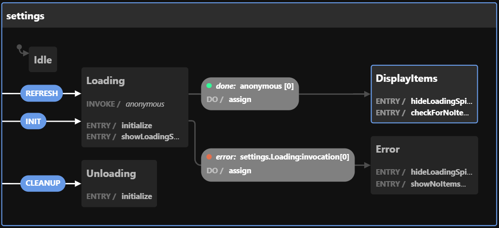

# NgFsm

**_Component State POC_**

    
    
    

### XState Links:
- [xstate.js.org](https://xstate.js.org/)
- [Documentation](https://xstate.js.org/docs)
- [Github](https://github.com/statelyai/xstate)
- [Editor](https://stately.ai/editor)
- [Visualizer](https://stately.ai/viz)
